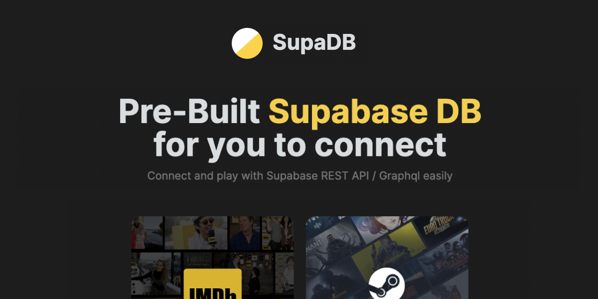

<!-- PROJECT LOGO -->
<br />
<p align="center">
  <a href="https://github.com/zernonia/supadb">
    
  </a>

  <h3 align="center">SupaDB</h3>

  <p align="center">
    Connect and play with <strong><a href="https://supabase.io/">Supabase</a></strong> REST API / Graphql easily
    <br />
    Free • Open Source
    <br />
    <br />
    <a href="https://supadb.dev/">View Demo</a>
    ·
    <a href="https://github.com/zernonia/supadb/issues">Report Bug</a>
    ·
    <a href="https://github.com/zernonia/supadb/issues">Request Feature</a>
  </p>
</p>



## 🚀 Features

- 🤩 Free
- 🚀 Unlimited API Request
- 🎨 Alowed to use on other project

## 📇 About The Project

This is my **Supabase Bring the Func(🕺) Hackathon 2022** submission!

**SupaDB** allows user that wanted to play with Supabase REST API/Grahql easily without having to manually seed the database.

**SupaDB** also allows Frontend Developer that wanted to focus on design to easily fetch the data without worrying about CORS stuff.

## Architecture

### Insert/Update Data

1. CRON Job by GitHub action
2. Vercel Serverless to scrap data
3. Upsert data into Supabase Database

### Fetch Data

1. Create custom secret for every user

```sql
create or replace function generate_secret ()
  returns text
  language plpgsql
  as
  $$
    begin
      return substr(md5(random()::text), 0, 25);
    end;
  $$
```

2. Wrap the secret in JWT token, set as Authorization Key in header

3. RLS to verify secret token exist in request

```sql
create or replace function auth.verify() returns text as $$
  select coalesce(
    nullif(current_setting('request.jwt.claim.secret', true), ''),
    nullif(current_setting('request.jwt.claims', true), '')::jsonb ->> 'secret'
  )::text

$$ language sql stable;
```

### 🔨 Built With

- [Vue 3](https://vuejs.org/)
- [Vite](https://vitejs.dev/)
- [WindiCSS](https://windicss.org/)

## 🌎 Local Development

### Prerequisites

Yarn

- ```sh
  npm install --global yarn vercel
  ```

### Development

1. Clone the repo
   ```sh
   git clone https://github.com/zernonia/supadb.git
   ```
2. Install NPM packages
   ```sh
   cd supadb
   yarn install
   ```
3. Run local Vercel development instance
   ```sh
   vercel dev
   ```

## ➕ Contributing

Contributions are what make the open source community such an amazing place to be learn, inspire, and create. Any contributions you make are **greatly appreciated**.

1. Fork the Project
2. Create your Feature Branch (`git checkout -b feature/AmazingFeature`)
3. Commit your Changes (`git commit -m 'Add some AmazingFeature'`)
4. Push to the Branch (`git push origin feature/AmazingFeature`)
5. Open a Pull Request

## 📜 License

Not Associated with Supabase.

Distributed under the MIT License. See `LICENSE` for more information.

# 📧 Contact

Zernonia - [@zernonia](https://twitter.com/zernonia) - zernonia@gmail.com

Also, if you like my work, please buy me a coffee ☕😳

<a href="https://www.buymeacoffee.com/zernonia" target="_blank">
    
  </a>
